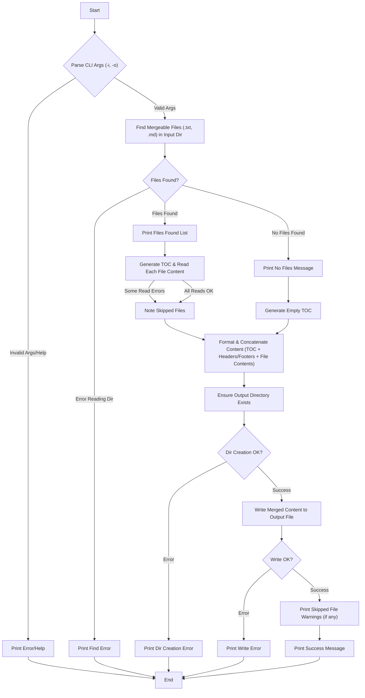

# Haskell File Merging Implementation Details

This document details the implementation approach, logic flow, and design choices for the Haskell-based file merging utility.

## Logic Flowchart (Mermaid)

```mermaid
graph TD
    A[Start] --> B{Parse CLI Args (-i, -o)};
    B -- Valid Args --> C[Find Mergeable Files (.txt, .md) in Input Dir];
    B -- Invalid Args/Help --> D[Print Error/Help];
    D --> Z[End];

    C --> E{Files Found?};
    E -- Error Reading Dir --> F[Print Find Error];
    F --> Z;
    E -- No Files Found --> G[Print No Files Message];
    G --> H[Generate Empty TOC];

    E -- Files Found --> I[Print Files Found List];
    I --> J[Generate TOC & Read Each File Content];
    J -- Some Read Errors --> K[Note Skipped Files];
    J -- All Reads OK --> K;

    K --> L[Format & Concatenate Content (TOC + Headers/Footers + File Contents)];
    H --> L;  // Path for no files found also leads to content generation (just TOC)

    L --> M[Ensure Output Directory Exists];
    M --> N{Dir Creation OK?};
    N -- Error --> O[Print Dir Creation Error];
    O --> Z;

    N -- Success --> P[Write Merged Content to Output File];
    P --> Q{Write OK?};
    Q -- Error --> R[Print Write Error];
    R --> Z;

    Q -- Success --> S[Print Skipped File Warnings (if any)];
    S --> T[Print Success Message];
    T --> Z;
```


## deepseek

```mermaid
graph TD
    A[Start] --> B["Parse CLI Args (-i, -o)"]
    B -- Valid Args --> C["Find Mergeable Files (.txt, .md) in Input Dir"]
    B -- Invalid Args/Help --> D["Print Error/Help"]
    D --> Z[End]

    C --> E{"Files Found?"}
    E -- Error Reading Dir --> F["Print Find Error"]
    F --> Z
    E -- No Files Found --> G["Print No Files Message"]
    G --> H["Generate Empty TOC"]

    E -- Files Found --> I["Print Files Found List"]
    I --> J["Generate TOC & Read Each File Content"]
    J -- Some Read Errors --> K["Note Skipped Files"]
    J -- All Reads OK --> K

    K --> L["Format & Concatenate Content (TOC + Headers/Footers + File Contents)"]
    H --> L  %% Path for no files found also leads to content generation

    L --> M["Ensure Output Directory Exists"]
    M --> N{"Dir Creation OK?"}
    N -- Error --> O["Print Dir Creation Error"]
    O --> Z

    N -- Success --> P["Write Merged Content to Output File"]
    P --> Q{"Write OK?"}
    Q -- Error --> R["Print Write Error"]
    R --> Z

    Q -- Success --> S["Print Skipped File Warnings (if any)"]
    S --> T["Print Success Message"]
    T --> Z
```

(gemini pro2.5错了3次 = 1次cursor api + 2次 aistudio)


### grok
```mermaid
graph TD
    A[Start] --> B{"Parse CLI Args (-i, -o)"}
    B -- Valid Args --> C[Find Mergeable Files (.txt, .md) in Input Dir]
    B -- Invalid Args/Help --> D[Print Error/Help]
    D --> Z[End]
    C --> E{Files Found?}
    E -- Error Reading Dir --> F[Print Find Error]
    F --> Z
    E -- No Files Found --> G[Print No Files Message]
    G --> H[Generate Empty TOC]
    E -- Files Found --> I[Print Files Found List]
    I --> J[Generate TOC & Read Each File Content]
    J -- Some Read Errors --> K[Note Skipped Files]
    J -- All Reads OK --> K
    K --> L[Format & Concatenate Content (TOC + Headers/Footers + File Contents)]
    H --> L
    L --> M[Ensure Output Directory Exists]
    M --> N{Dir Creation OK?}
    N -- Error --> O[Print Dir Creation Error]
    O --> Z
    N -- Success --> P[Write Merged Content to Output File]
    P --> Q{Write OK?}
    Q -- Error --> R[Print Write Error]
    R --> Z
    Q -- Success --> S[Print Skipped File Warnings (if any)]
    S --> T[Print Success Message]
    T --> Z
```


## Implementation Overview

The implementation follows a standard Haskell project structure with separate library and executable components, promoting modularity and testability.

1.  **Configuration (`src/MergeFiles.hs -> AppConfig`):** A simple record to hold the input directory and output file path.
2.  **CLI Parsing (`app/Main.hs -> optsParser`):** Uses `optparse-applicative` to define and parse command-line arguments, providing automatic help generation and error reporting for invalid input. The result is an `AppConfig`.
3.  **File Discovery (`src/MergeFiles.hs -> findMergeableFiles`):**
    *   Takes the input directory path.
    *   Validates directory existence.
    *   Lists directory contents, safely handling potential IO errors using `try`.
    *   Filters for files with `.txt` or `.md` extensions (case-insensitive).
    *   Returns `Either String [FilePath]`, clearly indicating success (with a sorted list of relative paths) or failure (with an error message).
4.  **Content Merging (`src/MergeFiles.hs -> mergeFilesContent`):**
    *   Takes the base input directory and the list of relative file paths.
    *   Generates a Table of Contents string.
    *   Iterates through the file list, attempting to read each file using `TIO.readFile` (which handles text encoding) wrapped in `try`.
    *   Collects successfully read content and records files that failed to read (skipped files) along with the error.
    *   Formats the content of each successfully read file using `formatFileContent` (adds headers/footers, trims whitespace).
    *   Concatenates the TOC and all formatted content blocks.
    *   Returns a `MergedFileResult` containing the final `Text`, list of processed files, and list of skipped files.
5.  **Output Writing (`src/MergeFiles.hs -> writeMergedFile`):**
    *   Takes the output file path and the final merged `Text`.
    *   Ensures the necessary output directory exists (`createDirectoryIfMissing`).
    *   Writes the `Text` content to the specified file, handling potential IO errors using `try`.
    *   Returns `Either String ()` to indicate success or failure.
6.  **Orchestration (`app/Main.hs -> main`):**
    *   Parses arguments.
    *   Calls `findMergeableFiles`.
    *   Calls `mergeFilesContent`.
    *   Reports any skipped files to `stderr`.
    *   Calls `writeMergedFile`.
    *   Prints final success or error messages based on the results of the library calls.

## Why This Approach?

*   **Library/Executable Split:** Enhances modularity. The core logic in `MergeFiles` is independent of the command-line interface and can be potentially reused or tested separately.
*   **Explicit Error Handling (`Either`, `try`):** Avoids runtime crashes due to expected IO failures (e.g., file not found, permissions). Using `Either String a` makes function signatures clearly state that they can fail and return an error message.
*   **`optparse-applicative`:** The standard and robust way to handle CLI arguments in Haskell, providing features like default values, help text, and type safety.
*   **`Data.Text`:** Preferred over `String` for performance and correct handling of Unicode characters, which is important when dealing with file content.
*   **Focus on Core Task:** The file discovery (`findMergeableFiles`) currently scans only the top-level directory as per the typical interpretation of the requirement. It doesn't recurse into subdirectories, keeping the logic simpler.
*   **Immutability:** Leverages Haskell's default immutability. Data structures are created and passed; functions return new values instead of modifying existing ones in place, simplifying reasoning.

## Advantages of Haskell for This Task

While many languages could accomplish this, Haskell offers several advantages, particularly stemming from its functional nature:

1.  **Reliability (Strong Static Typing):** The compiler catches many errors *before* runtime (e.g., type mismatches, unhandled cases in pattern matching). This leads to more robust applications compared to dynamically typed languages.
2.  **Predictability (Immutability):** Since data doesn't change unexpectedly, it's easier to understand the state of the program at any point and avoid bugs common in imperative code where variables are frequently mutated.
3.  **Testability (Purity):** Functions that don't perform IO (like `formatFileContent`) are *pure*. They always produce the same output for the same input, making them extremely easy to unit test reliably (as seen in `test/Spec.hs`). Haskell encourages separating pure logic from IO actions.
4.  **Robustness (Explicit Effects & Error Handling):** The `IO` monad makes it clear which parts of the code interact with the outside world. Combined with types like `Either`, error handling becomes explicit and less likely to be overlooked, preventing unexpected crashes.
5.  **Expressiveness:** Higher-order functions (`map`, `filter`, `forM`) allow for concise and declarative expression of operations on data (like processing the list of files), often reducing boilerplate code compared to manual loops in other languages.

Compared to an imperative language, the Haskell approach emphasizes expressing the *transformation* of data (from file paths to merged content) rather than detailing step-by-step mutations. Compared to the Rust version, while both are statically typed and aim for robustness, Haskell leans more on purity, garbage collection, and its type system for safety, whereas Rust heavily emphasizes compile-time memory safety via its ownership and borrowing rules.

## How to Build, Test, and Run

(Navigate to the `merge_files_haskell` directory first)

*   **Build All:** `cabal build all`
*   **Run Tests:** `cabal test`
*   **Run Executable:** `cabal run merge-files-haskell -- -o <output_file> [-i <input_dir>]`
    *   Example: `cabal run merge-files-haskell -- -i ./notes -o ./merged_notes.md` 